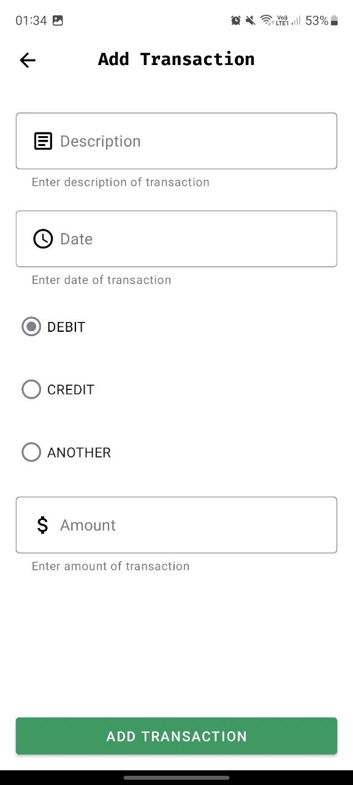

# Financial Wallet

The Daily Ledger Wallet is a sleek and intuitive solution designed to simplify and organize your daily transactions. 
This innovative wallet is not just a physical storage space for cash and cards; it's a comprehensive tool that seamlessly integrates with your lifestyle, 
helping you track and manage your daily expenses effortlessly.

## Usage

- Create account in Sign Up feature
- Sign in with this account
- Adding transactions with you need

### Check this video on Youtube Channel
- [Android app to manager transactions](https://youtu.be/weq8AasuRoI)

## How to start the application

Note: This application is only available for Android devices and you need to have Java 8 or more installed on your computer.

1. Clone the repository
2. Open the project in Android Studio
3. Run the application
4. Enjoy!

## UI/UX

The user interface (UI) and user experience (UX) are designed using the following technologies:

- Material Design
- Android Based Layout

|             |          |
| :--------------------------------: | :----------------------------: |
|         _Login_                    |         _Home_                 |
|                :--:                |              :--:              |
|      |  |
|         _Form Sign Up_             |          _Form Transaction_    |

## Author

This code is written by Frank Laércio.

## License

This project is licensed under the MIT License rules - see the LICENSE.md file for more details.
